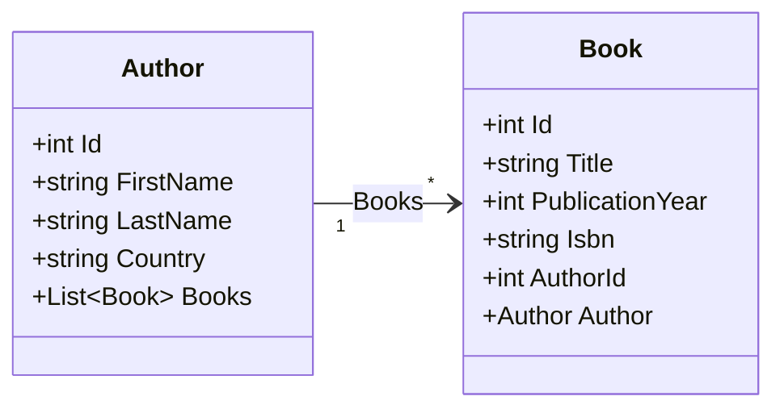

# UML Class Diagram

```mermaid
classDiagram
    direction LR
    class Author {
        +int Id
        +string FirstName
        +string LastName
        +string Country
        +List~Book~ Books
    }

    class Book {
        +int Id
        +string Title
        +int PublicationYear
        +string Isbn
        +int AuthorId
        +Author Author
    }

    Author "1" --> "*" Book : Books
```
